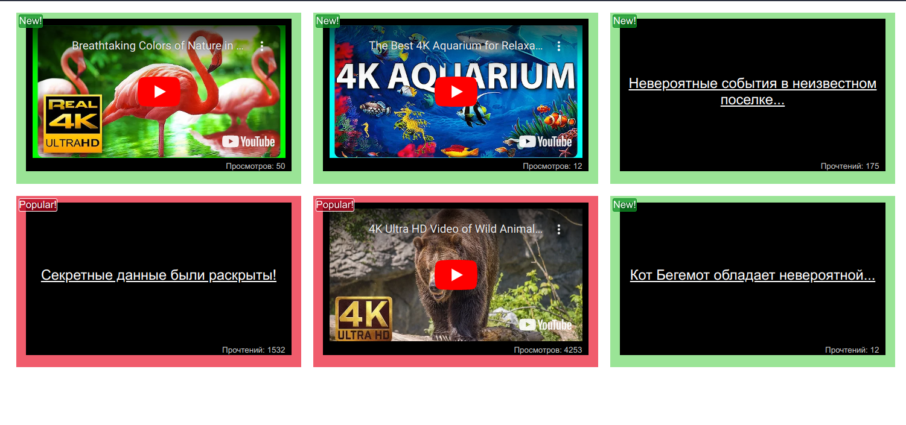

# Подсвечивание блоков

===

На нашем сайте есть блоки со статьями и с видеозаписями.

Мы решили улучшить отображение наших блоков таким образом, чтобы популярные статьи и видео, у которых 1000+ прочтений или просмотров,
оборачивались в компонент `Popular`, а с количеством до 100 — в компонент `New`. Эти компоненты будут менять внешний облик блоков, привлекая внимание посетителей.

## Реализация

Использем HOC, оберачиваем `Video` и `Article` таким образом, чтобы при отображении в компоненте `List` они помещались внутрь требуемого компонента `Popular` или `New`.

## Результат

## Available Scripts

In the project directory, you can run:

### `npm start`

Runs the app in the development mode.\
Open [http://localhost:3000](http://localhost:3000) to view it in your browser.

The page will reload when you make changes.\
You may also see any lint errors in the console.
